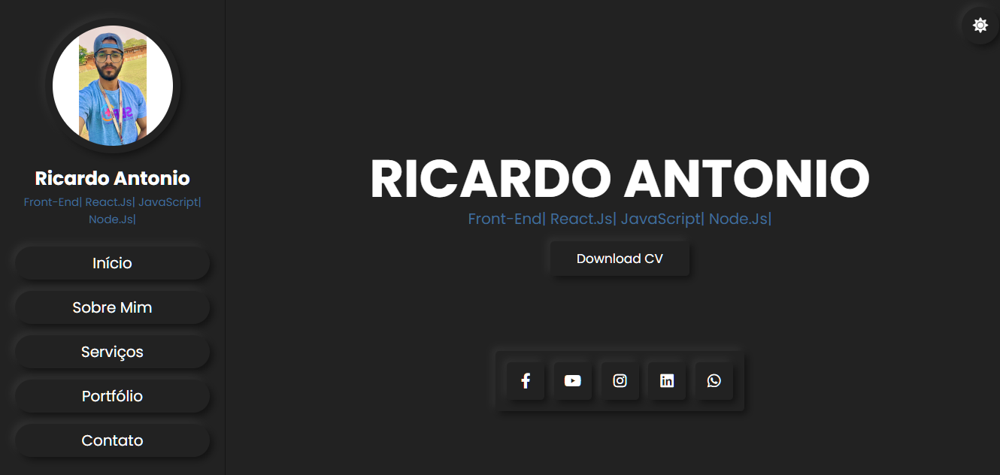
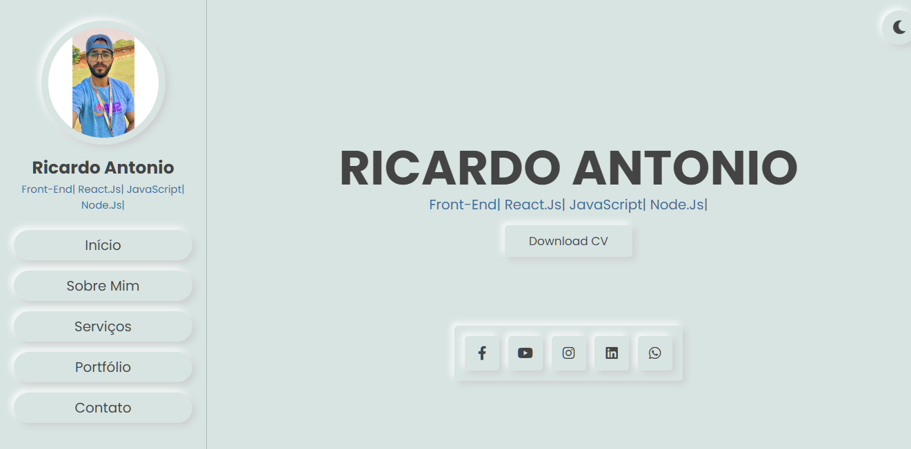

<h1 align="center"> Portfólio </h1>

  
   

## 🚀 Tecnologias

Esse projeto foi desenvolvido com as seguintes tecnologias:

- HTML 
- CSS
- JavaScript

## 💻 Projeto

Portfólio criado no evento THE CODER PASS https://www.youtube.com/watch?v=ykQdvYZpWHY

- [Acesse o projeto finalizado, online](https://ricantony6.github.io/Login-animado/)

♥ Ricardo Antonio Rodrigues
