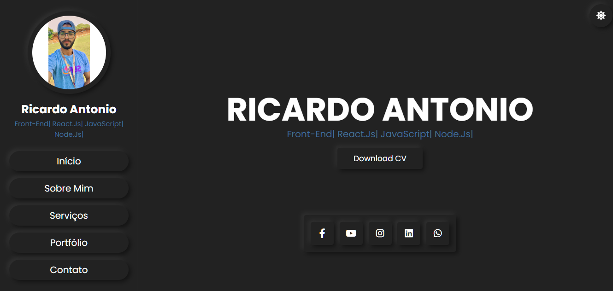
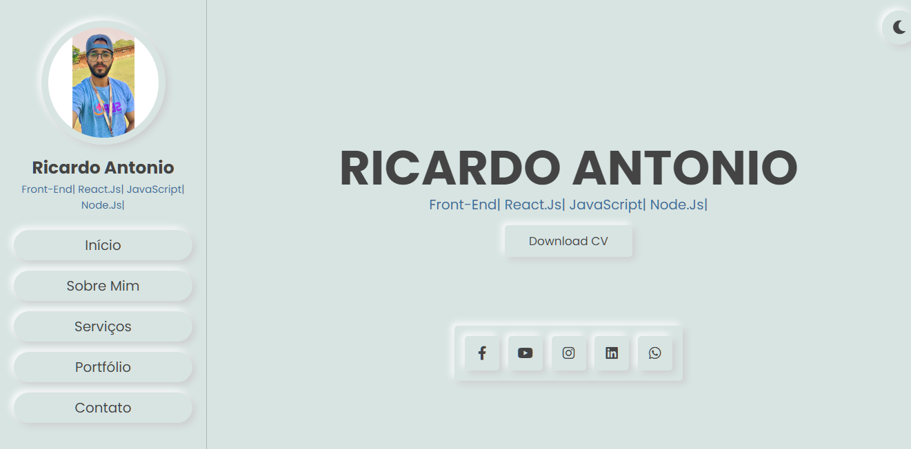

<h1 align="center">🌟 Portfólio</h1>

  
  

---

## 🚀 Tecnologias  

Esse projeto foi desenvolvido com as seguintes tecnologias:  

- 🟦 **HTML**  
- 🎨 **CSS**  
- ⚡ **JavaScript**  

---

## 💻 Projeto  

📌 Este **Portfólio** foi criado durante o evento **THE CODER PASS**.  
🎥 Confira o evento no YouTube: [Assistir vídeo](https://www.youtube.com/watch?v=ykQdvYZpWHY)  

👉 [Acesse o projeto finalizado, online](https://ricantony6.github.io/Portifolio/)  

---

  
  Feito com ♥ por <strong>Ricardo Antonio Rodrigues</strong>  

